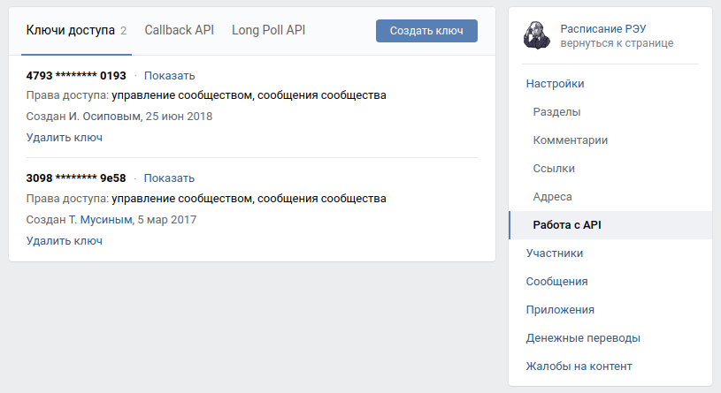

# Бот-помощник

## Описание проекта

Скрипт позволяет автоматизировать процесс ответа на типичные вопросы.

Когда бот получает сообщение от пользователя, то ищет совпадение с шаблонами в базе и отвечает 
соответствующим сообщением. Если сообщение пользователя не совпало ни с одним шаблоном, то бот
отправляет сообщение по типу 'Вот эта последняя фраза мне не ясна', предоставляя право ответа оператору.

Проект реализован для двух социальных сетей:
- [Telegram](https://web.telegram.org/)
- [VK](https://vk.com/)

## Как запустить

- Скачайте код:
```shell
$ git clone https://github.com/Alex-Men-VL/notification_bot.git
$ cd notification_bot
```
- Установите зависимости:
```shell
$ pip install -r requirements.txt
```
- Запустите бота в Telegram:
```shell
$ python3 start_tg_bot.py
```
- Запустите бота в VK:
```shell
$ python3 start_vk_bot.py
```

## Переменные окружения
Часть данных берется из переменных окружения. Чтобы их определить, создайте файл `.env` в корне проекта и 
запишите туда данные в таком формате: `ПЕРЕМЕННАЯ=значение`

Доступны три переменные:

- `TELEGRAM_BOT_TOKEN` - токен телеграм бота;
  - Чтобы его получить, напишите в Telegram специальному боту: [BotFather](https://telegram.me/BotFather)
- `PROJECT_ID` - id проект в `Google Cloud Console`.

<details>
  <summary markdown="span">Как добавить интеграцию с DialogFlow</summary>

  - Создайте проект в DialogFlow
    - [Сайт DialogFlow](https://dialogflow.cloud.google.com/#/login)
    - [Как создать проект в DialogFlow](https://cloud.google.com/dialogflow/docs/quick/setup)
  - [Создайте агента](https://cloud.google.com/dialogflow/docs/quick/build-agent)
    - Идентификатор проекта из прошлого шага
    - Русский язык, иначе бот не будет понимать ваши фразы
</details>

- `LANGUAGE_CODE` - код языка, выбранный при создании проекта на [DialogFlow](https://dialogflow.cloud.google.com/#/login). По умолчанию `ru`
- `GOOGLE_APPLICATION_CREDENTIALS` - путь до файла с ключами. [Создание JSON-ключа](https://cloud.google.com/docs/authentication/getting-started)
- `VK_BOT_TOKEN` - токен группы во Вконтакте

<details>
  <summary markdown="span">Как получить токен группы</summary>

  В меню “Работа с API”:

  
</details>

- `TG_DEV_CHAT_ID` - id пользователя в телеграм, кому будут приходить сообщения с ошибками.

## Пример работы ботов

#### Пример результата для ВКонтакте:


#### Пример результата для Telegram:


## Цель проекта

Код написан в образовательных целях на онлайн-курсе для веб-разработчиков [dvmn.org](https://dvmn.org/)